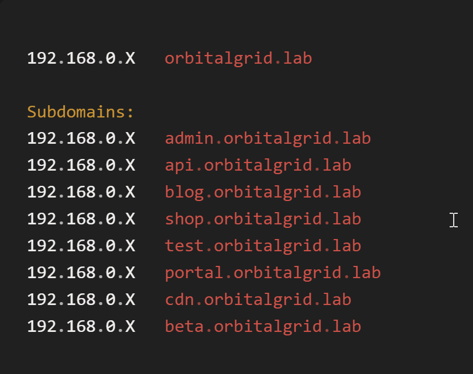
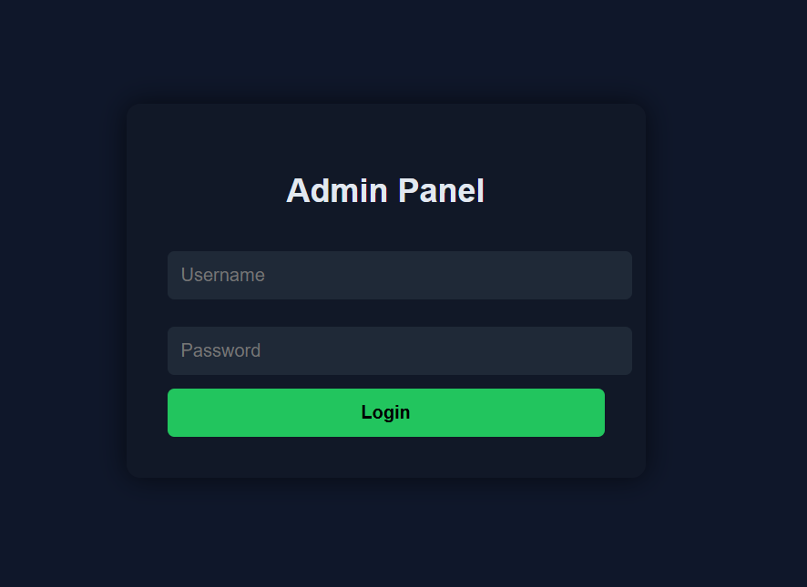
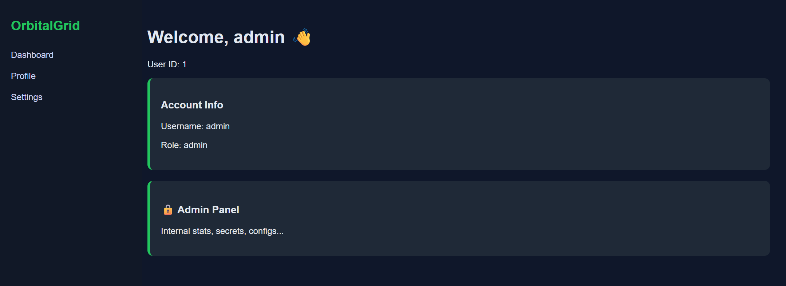
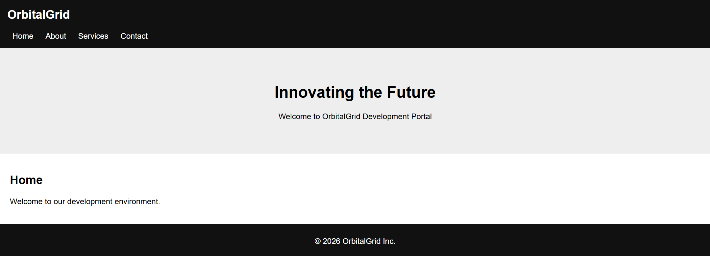

# Multi-VHost Security Lab

A custom enterprise-style penetration testing lab built for hands-on cybersecurity practice.  
This environment simulates a realistic internal infrastructure with multiple vulnerable web applications hosted across **11 virtual hosts**.

---

## Project Overview

This lab was designed to improve practical penetration testing skills including:

- Reconnaissance and enumeration
- Web application testing
- Exploitation of common vulnerabilities
- Privilege escalation concepts
- Reporting and remediation workflow

---

## Infrastructure

- 11 domain-based virtual hosts
- Apache / Nginx web services
- Linux-based environment
- Custom DNS / hosts file routing
- Realistic business-style structure

---

## Simulated Vulnerabilities

- SQL Injection
- Cross-Site Scripting (XSS)
- IDOR
- Authentication flaws
- File Upload issues
- Misconfigurations
- Information Disclosure

---

## Tools Used

- Kali Linux
- Burp Suite
- Nmap
- Gobuster
- Dirsearch
- SQLMap
- Bash
- Python

---

## Skills Demonstrated

- Web Application Penetration Testing
- Enumeration
- Vulnerability Validation
- Manual Testing
- Basic Automation
- Security Mindset

---

## Purpose

Built as a personal project to strengthen real-world penetration testing experience and simulate enterprise attack surfaces.

---

## Author
Doniyor Sotiboldiyev
Junior Penetration Tester

---

## Screenshots

### Subdomain Infrastructure

### Admin Login Panel

### Internal Dashboard

### Development Portal

### Shop Environment

### Beta Environment

### Portal

### CDN

### Test Environment

